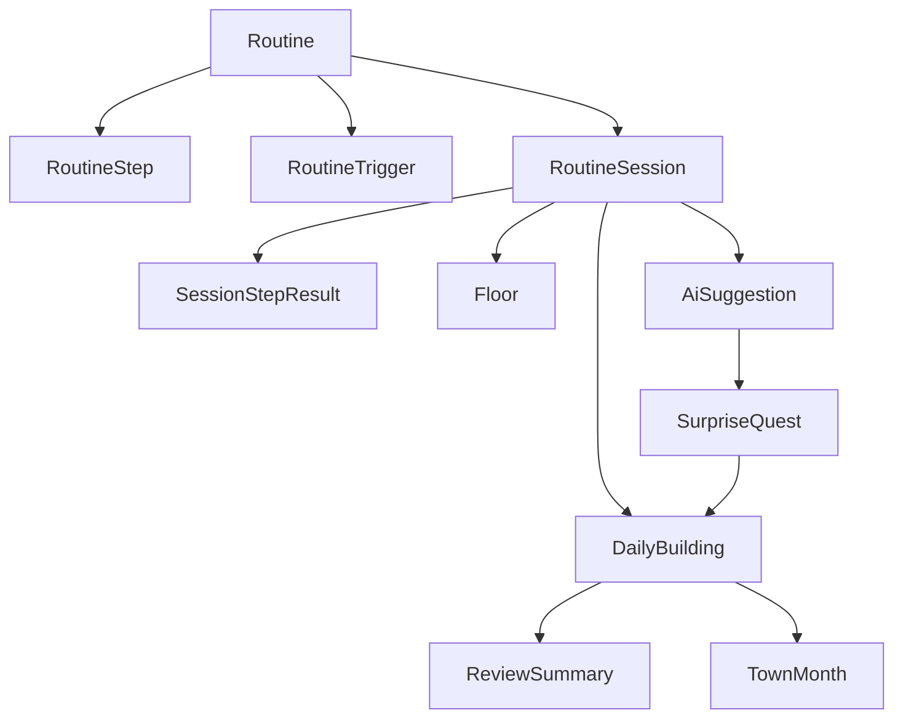

# Questown Data Model

## 1. 목적

이 문서는 Questown의 **목표 제품 모델**을 정의하는 canonical source다. 현재 코드베이스의 `QuestItem / DailyRecord / MonthlyTown`는 전환 전 baseline일 뿐이며, 최종 기준 모델은 `routine / session / building / town` 구조다.

핵심 원칙:

- 제품의 최소 단위는 `todo`가 아니라 `RoutineSession`
- `DailyBuilding`과 `TownMonth`는 session 결과의 집계 산출물
- AI 출력은 직접 상태를 확정하지 않고 `suggestion/proposal` 레이어를 통해 반영
- `location` trigger는 데이터 모델에는 존재하지만 MVP 활성 범위에서는 off 가능

## 2. 모델 개요



설계 방향은 event-first, aggregate-later다.

- source of truth: `Routine`, `RoutineStep`, `RoutineTrigger`, `RoutineSession`, `SessionStepResult`, `SurpriseQuest`, `AiSuggestion`
- aggregate snapshot: `DailyBuilding`, `TownMonth`, `ReviewSummary`
- runtime/UI state: launcher selection, active timer state, overlay state, notification entry state

## 3. 핵심 enum

```ts
type RoutineCategory =
  | "morning_reset"
  | "leave_home_sprint"
  | "commute_focus"
  | "arrival_setup"
  | "night_shutdown"
  | "weekend_reset"
  | "custom";

type TriggerType = "manual" | "time" | "location" | "ai_recommended";

type SessionStatus = "idle" | "active_step" | "paused" | "completed" | "reviewed";

type StepResultStatus = "success" | "grace_completed" | "late_completed" | "skipped";

type ResultGrade = "Perfect" | "Great" | "Clear" | "Partial";

type RoofType = "none" | "low" | "mid" | "high" | "gold";

type QualityTier = "standard" | "refined" | "signature";

type SurpriseQuestStatus = "proposed" | "accepted" | "completed" | "skipped" | "expired";

type SuggestionType =
  | "routine_recommendation"
  | "routine_template"
  | "duration_tune"
  | "trigger_tune"
  | "surprise_quest"
  | "review_commentary"
  | "tomorrow_hint";
```

## 4. Canonical persisted model

### 4.1 Routine

```ts
interface Routine {
  id: string;
  name: string;
  category: RoutineCategory;
  estimatedDurationSec: number;
  themeKey: string;
  difficulty: 1 | 2 | 3 | 4 | 5;
  successProfile: "strict" | "balanced" | "gentle";
  isEnabled: boolean;
  createdAt: string;
  updatedAt: string;
}
```

- 용도: 플레이 가능한 루틴 템플릿
- 생성 시점: 템플릿 설치, 사용자 생성, AI 제안 수락
- source of truth 여부: persisted source

### 4.2 RoutineStep

```ts
interface RoutineStep {
  id: string;
  routineId: string;
  title: string;
  order: number;
  recommendedDurationSec: number;
  minimumCompletion: "complete" | "grace_or_better" | "any_finished";
  difficulty: 1 | 2 | 3 | 4 | 5;
  tags: string[];
  completionFxKey: string;
  isOptional: boolean;
}
```

- 용도: 루틴 내부 stage 단위
- 생성 시점: routine 생성/수정 시
- source of truth 여부: persisted source

### 4.3 RoutineTrigger

```ts
interface RoutineTrigger {
  id: string;
  routineId: string;
  triggerType: TriggerType;
  triggerConfig:
    | { type: "manual" }
    | { type: "time"; weekdayMask: number[]; startMinuteOfDay: number; endMinuteOfDay: number }
    | { type: "location"; geofenceId: string; enterOrExit: "enter" | "exit" }
    | { type: "ai_recommended"; recommendationWindowMin: number };
  priority: number;
  cooldownMinutes: number;
  isEnabled: boolean;
}
```

- 용도: 루틴이 언제 surfaced 되는지 정의
- 생성 시점: routine 설정, AI 제안 수락
- MVP 활성 범위: `manual`, `time`, `ai_recommended`

### 4.4 RoutineSession

```ts
interface RoutineSession {
  id: string;
  routineId: string;
  dateKey: string;
  startedAt: string;
  endedAt?: string;
  triggerSource: TriggerType;
  status: SessionStatus;
  resultGrade?: ResultGrade;
  baseScore: number;
  timeBonus: number;
  comboBonus: number;
  clearBonus: number;
  focusBonus: number;
  streakBonus: number;
  totalScore: number;
  normalizedScore?: number;
  completedStepCount: number;
  skippedStepCount: number;
  pausedCount: number;
  wasGraceApplied: boolean;
  aiSuggestionId?: string;
}
```

- 용도: 실제 한 번의 플레이 기록
- 생성 시점: session start
- source of truth 여부: persisted source

### 4.5 SessionStepResult

```ts
interface SessionStepResult {
  id: string;
  sessionId: string;
  stepId: string;
  order: number;
  status: StepResultStatus;
  startedAt: string;
  endedAt: string;
  elapsedSec: number;
  targetDurationSec: number;
  overtimeSec: number;
  pauseCount: number;
  comboIndexAfterStep: number;
  scoreEarned: number;
}
```

- 용도: step 단위 판정과 점수 산출 근거
- 생성 시점: 각 step 종료 시
- source of truth 여부: persisted source

### 4.6 DailyBuilding

```ts
interface DailyBuilding {
  dateKey: string;
  sessionIds: string[];
  floorIds: string[];
  roofType: RoofType;
  ornamentIds: string[];
  totalScore: number;
  successfulSessionCount: number;
  averageNormalizedScore: number;
  streakSnapshot: Record<string, number>;
  reviewSummaryId?: string;
  finalizedAt?: string;
}
```

- 용도: 하루 단위 building snapshot
- 생성 시점: day review 완료 또는 next-day rollover
- source of truth 여부: persisted aggregate cache
- 재생성 가능 여부: session records로부터 rebuild 가능

### 4.7 Floor

```ts
interface Floor {
  id: string;
  sessionId: string;
  dateKey: string;
  routineCategory: RoutineCategory;
  visualStyleKey: string;
  qualityTier: QualityTier;
  ornamentIds: string[];
}
```

- 용도: building을 구성하는 층 단위 시각 결과물
- 생성 시점: `Clear` 이상 session 종료 시
- source of truth 여부: persisted aggregate cache

### 4.8 SurpriseQuest

```ts
interface SurpriseQuest {
  id: string;
  dateKey: string;
  title: string;
  contextType: "home" | "commute" | "work" | "night" | "health" | "generic";
  difficulty: 1 | 2 | 3 | 4 | 5;
  rewardType: "ornament" | "score" | "theme_token";
  status: SurpriseQuestStatus;
  sourceSuggestionId?: string;
  acceptedAt?: string;
  completedAt?: string;
  expiresAt?: string;
}
```

- 용도: 핵심 루틴 외의 작은 라이브 미션
- 생성 시점: AI 제안 또는 rule-based fallback
- source of truth 여부: persisted source

### 4.9 TownMonth

```ts
interface TownMonth {
  monthKey: string;
  seasonTheme: "spring" | "summer" | "autumn" | "winter";
  plotSnapshots: Array<{
    dateKey: string;
    floorCount: number;
    roofType: RoofType;
    ornamentIds: string[];
  }>;
  landmarkIds: string[];
  totalFloorCount: number;
  generatedAt: string;
}
```

- 용도: 월간 town 렌더링용 snapshot
- 생성 시점: month open 시 lazy build, building 변경 시 refresh
- source of truth 여부: persisted aggregate cache

### 4.10 AiSuggestion

```ts
interface AiSuggestion {
  id: string;
  type: SuggestionType;
  targetDateKey?: string;
  targetRoutineId?: string;
  generatedAt: string;
  reasoningSummary: string;
  confidence: number;
  applied: boolean;
  expiresAt?: string;
  payload: Record<string, unknown>;
}
```

- 용도: AI가 만든 제안과 설명 기록
- 생성 시점: launcher 추천, duration tuning, review 생성 시
- source of truth 여부: persisted source

### 4.11 ReviewSummary

```ts
interface ReviewSummary {
  id: string;
  dateKey: string;
  generatedAt: string;
  headline: string;
  body: string;
  stableRoutines: string[];
  frictionPoints: string[];
  tomorrowHints: string[];
  source: "ai" | "fallback";
}
```

- 용도: 하루 리뷰에서 보여주는 텍스트 요약
- 생성 시점: day review 준비 시
- source of truth 여부: persisted aggregate cache

## 5. Derived model

아래 모델들은 persisted source가 아니라 계산 결과물이다.

```ts
interface LauncherState {
  startableRoutine: Routine | null;
  nextScheduledRoutine: Routine | null;
  todayBuildingPreview: DailyBuilding | null;
  routineStreakSummary: Record<string, number>;
  surpriseQuestPreview: SurpriseQuest | null;
}

interface ActiveSessionViewModel {
  sessionId: string;
  currentStep: RoutineStep;
  nextStep?: RoutineStep;
  elapsedSec: number;
  remainingSec: number;
  progressRatio: number;
  combo: number;
}

interface TownPlotViewModel {
  dateKey: string;
  isToday: boolean;
  hasBuilding: boolean;
  floorCount: number;
  roofType: RoofType;
  ornamentCount: number;
}
```

파생 모델은 UI 렌더링과 selector 최적화에만 사용한다.

## 6. Runtime / UI state

런타임 상태는 persisted model과 분리한다.

대표 예시는 아래다.

- 현재 열려 있는 세션 overlay
- 현재 step 타이머 틱
- review overlay open 여부
- notification deep-link payload
- AI suggestion expanded/collapsed 상태

런타임 상태는 앱을 종료해도 반드시 남겨야 하는 정보가 아니라면 UI store에만 둔다.

## 7. 이벤트 흐름

### 7.1 Session start

1. trigger evaluator가 startable routine을 계산
2. 사용자가 루틴 시작
3. `RoutineSession` 생성
4. 첫 `RoutineStep` 타이머 시작

### 7.2 Step completion

1. 현재 step 종료
2. `SessionStepResult` 생성
3. combo / grace / score 갱신
4. 다음 step으로 전이 또는 session 종료

### 7.3 Session finalize

1. grade 계산
2. `RoutineSession` 최종 점수 확정
3. `Clear` 이상이면 `Floor` 생성
4. 해당 날짜의 `DailyBuilding` cache 갱신

### 7.4 Day review finalize

1. 해당 날짜의 성공 session 집계
2. `roofType` 계산
3. `ReviewSummary` 생성
4. `DailyBuilding.finalizedAt` 설정
5. `TownMonth` plot refresh

## 8. 저장 전략

저장 전략은 local-first, versioned schema를 기본으로 한다.

### 8.1 저장 단위

권장 persisted slices:

- `routines`
- `routineSteps`
- `routineTriggers`
- `routineSessions`
- `sessionStepResults`
- `surpriseQuests`
- `aiSuggestions`
- `dailyBuildings`
- `townMonths`
- `settings`
- `migrationMeta`

### 8.2 source vs cache

- `Routine*`, `RoutineSession`, `SessionStepResult`, `SurpriseQuest`, `AiSuggestion`은 source of truth
- `DailyBuilding`, `Floor`, `TownMonth`, `ReviewSummary`는 rebuild 가능한 cache/snapshot

### 8.3 fallback

- AI suggestion이 없으면 rule-based fallback 텍스트와 추천을 생성한다.
- `TownMonth` cache가 없으면 `DailyBuilding`에서 재구성한다.
- `DailyBuilding` cache가 손상되면 `RoutineSession`에서 재구성한다.

## 9. 식별자 / 시간 규칙

- 모든 entity id는 opaque string이다.
- 네트워크/AI 응답 전제 없이 로컬에서 생성 가능해야 한다.
- 타임스탬프는 ISO-8601 UTC 문자열로 저장한다.
- `dateKey`, `monthKey`는 사용자 로컬 타임존 기준으로 계산한다.
- trigger evaluation도 사용자 로컬 타임존 기준으로 수행한다.
- 하루 경계는 `00:00 local time`이며, missed review는 next-day rollover에서 정산된다.

## 10. 레거시 매핑

현재 코드베이스 기준 baseline:

```ts
QuestItem
DailyRecord
MonthlyTown
```

### 10.1 QuestItem

- 현재 역할: 체크 가능한 단일 작업
- 목표 모델에서의 위치:
  - 장기적으로는 `RoutineStep` 설계의 원재료
  - 또는 migration 중 임시 `ManualQuickTask`로 흡수
- canonical model로 유지하지 않는다

### 10.2 DailyRecord

- 현재 역할: 날짜별 quest 집계
- 목표 모델에서의 위치:
  - `RoutineSession[]`와 `DailyBuilding` 사이의 전환 baseline
- 장기적으로 `RoutineSession -> DailyBuilding` 집계 구조로 대체한다

### 10.3 MonthlyTown

- 현재 역할: 월간 town 표현용 날짜 집계
- 목표 모델에서의 위치:
  - `TownMonth` snapshot의 초기 baseline
- 이후 `DailyBuilding` 기반 월간 집계로 교체한다

## 11. 현재 저장소에 대한 전환 메모

현재 저장소는 `Today / Town / Manage` + quest 체크 흐름을 전제로 만든 앱이다. 목표 제품은 이를 완전히 버리지는 않되, 아래 순서로 전환해야 한다.

1. routine/session domain을 병렬 도입
2. home을 launcher로 재구성
3. 기존 quest record는 migration source로 취급
4. building/town은 session-derived snapshot으로 재정의
